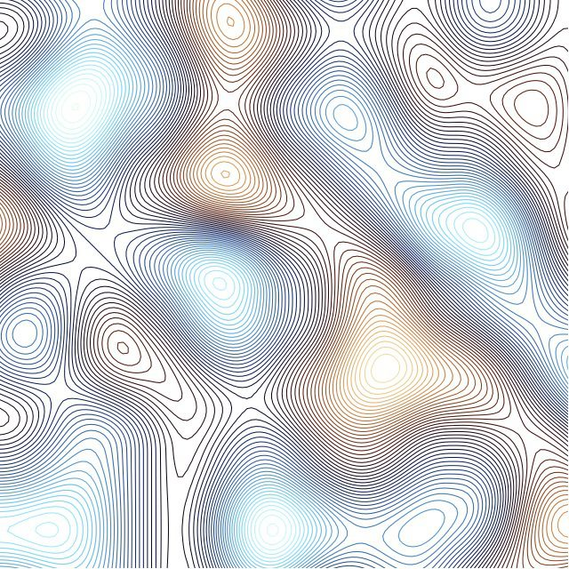

# thi.ng/ndarray



[example](src/contours.org#examples)

This library is a Clojure/Clojurescript port of Mikola Lysenko's
[ndarray core](https://github.com/scijs/ndarray) JS library for
multidimensional arrays with almost zero-cost views, re-ordering,
skipping and extended features and to make more sense in a Clojure
context.

Please see [index.org](src/index.org) for further information & examples.

## Current Leiningen coordinates

```clj
[thi.ng/ndarray "0.3.3"]
```
